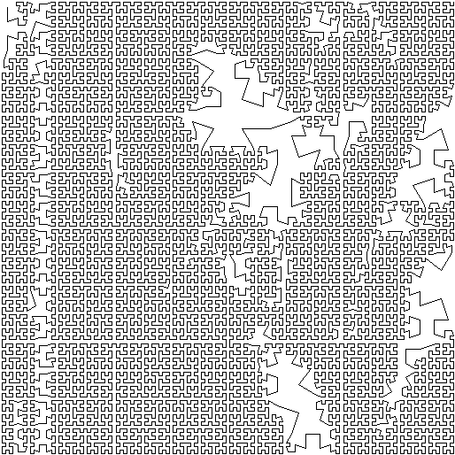

# fimgs - image filters tool

## Install

```bash
go install github.com/rprtr258/fimgs/cmd/fimgs@latest
```

## Usage

```php
NAME:
   fimgs - Applies filter to image

USAGE:
   Applies filter to image and saves new image

COMMANDS:
   edgedetect2      Edgedetect2 filter
   verticallines    Verticallines filter
   emboss           Emboss filter
   sharpen          Sharpen filter
   edgeenhance      Edgeenhance filter
   edgedetect1      Edgedetect1 filter
   horizontallines  Horizontallines filter
   blur             Blur filter
   weakblur         Weakblur filter
   cluster          Cluster colors
   quadtree         Quad tree filter
   shader           Shader filter
   hilbert          Hilbert curve filter
   hilbertdarken    Hilbert darken curve filter
   zcurve           Z curve filter
   median           Median filter
   help, h          Shows a list of commands or help for one command

GLOBAL OPTIONS:
   --image value, -i value  input image filename
   --help, -h               show help

```

## Examples

||||
|-|-|-|
||||
|blur.png|cluster.png|edgedetect1.png|
||||
|edgedetect2.png|edgeenhance.png|emboss.png|
||||
|hilbertdarken.png|hilbert.png|horizontallines.png|
||||
|median.png|orig.png|quadtree.png|
||||
|shader_rgb.png|sharpen.png|verticallines.png|
|||
|weakblur.png|zcurve.png|
